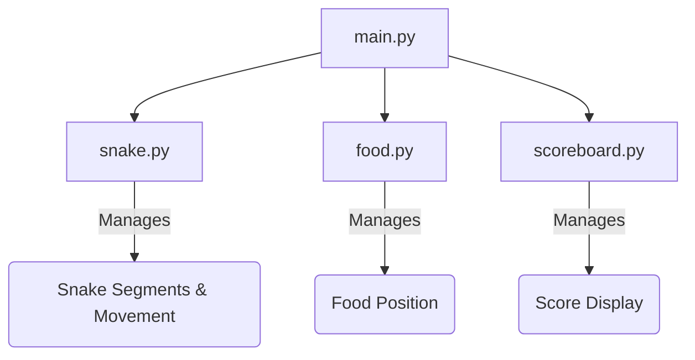

# Classic Snake Game in Python
[](https://deepwiki.com/mirchanv/100-Days-of-Code-The-Complete-Python-Pro-Bootcamp/tree/main/day_20-21_Snake_Game)

## Overview

This project is a classic Snake game built entirely in Python using the `turtle` module for graphics. The player controls a snake, guiding it to eat food pellets that appear on the screen. With each pellet eaten, the snake grows longer, and the player's score increases. The game ends if the snake collides with the screen boundaries or its own body.

This implementation demonstrates core programming concepts, including Object-Oriented Programming (OOP), event handling, and game loop management. The code is modular, with separate classes for the snake, the food, and the scoreboard, making it easy to understand and extend.

## Features

- **Classic Gameplay**: A faithful recreation of the timeless Snake game.
- **Keyboard Controls**: Intuitive control of the snake using the Up, Down, Left, and Right arrow keys.
- **Dynamic Growth**: The snake increases in length each time it consumes food.
- **Randomized Food**: Food pellets appear at random locations on the screen.
- **Live Scoreboard**: A scoreboard tracks the player's score in real-time.
- **Collision Detection**: The game ends upon collision with the walls or the snake's own tail.

## Project Structure

The project is organized into modular Python files, each handling a specific component of the game:

-   `main.py`: The main entry point of the game. It initializes the screen, creates instances of the `Snake`, `Food`, and `ScoreBoard` classes, and runs the main game loop.
-   `snake.py`: Defines the `Snake` class, which manages the snake's segments, movement, direction changes, and growth.
-   `food.py`: Defines the `Food` class, responsible for an individual food pellet's appearance and repositioning.
-   `scoreboard.py`: Defines the `ScoreBoard` class, which handles displaying the score and the "Game Over" message.



## How to Play

### Prerequisites

-   Python 3.x

The `turtle` module is part of the Python standard library, so no additional installations are required.

### Running the Game

1.  Clone or download this repository to your local machine.
2.  Navigate to the project directory in your terminal:
    ```sh
    cd day_20-21_Snake_Game
    ```
3.  Run the main script:
    ```sh
    python main.py
    ```
4.  Use the following keys to control the snake:
    -   **Up Arrow**: Move up
    -   **Down Arrow**: Move down
    -   **Left Arrow**: Move left
    -   **Right Arrow**: Move right

The goal is to achieve the highest score possible before the game ends
